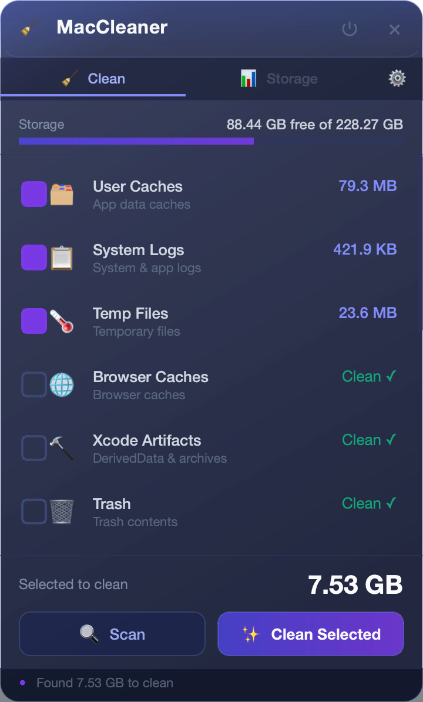
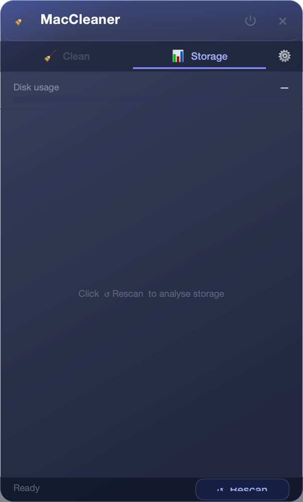
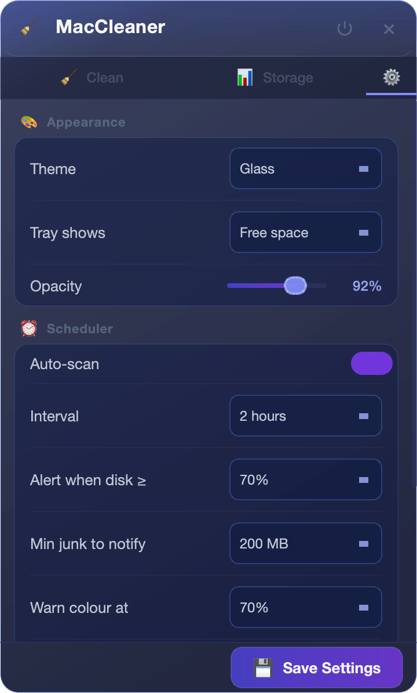

<p align="center">
  
</p>

<h1 align="center">MacCleaner</h1>

<p align="center">
  <strong>A lightweight, open-source storage cleaner for macOS — lives in your menu bar.</strong>
</p>

<p align="center">
  
  
  
  
  
</p>

<br />

> MacCleaner runs silently in the background and notifies you only when it matters — when your disk is actually getting full. No nags, no dark patterns, no subscription.

---

## ✨ Features

| | |
|---|---|
| 🧹 **Smart Junk Scanner** | Finds caches, logs, browser data, Xcode artifacts, old Python envs, Docker leftovers, and more across 14 categories |
| 📊 **Storage Analyser** | Maps your largest folders and flags `node_modules` directories draining GBs silently |
| ⏰ **Background Auto-scan** | Runs on a configurable schedule (1 h – 24 h) and alerts only when disk usage crosses your threshold |
| 🔔 **Threshold Alerts** | Separate warn (amber) and critical (red) thresholds — tray icon changes colour so you always know at a glance |
| ⚙️ **Full Settings Panel** | Theme, tray label, alert thresholds, scan interval, startup delay — all configurable without touching a config file |
| 🪟 **Glass Theme** | Frosted-glass UI that floats above other windows without cluttering your Dock |
| 🗑️ **Safe Deletion** | Moves files to macOS Trash, never hard-deletes — one undo if you change your mind |

---

## 📸 Screenshots

<p align="center">
  
  &nbsp;&nbsp;
  
  &nbsp;&nbsp;
  
</p>

<p align="center">
  <em>Clean &nbsp;·&nbsp; Storage &nbsp;·&nbsp; Settings</em>
</p>

---

## 🚀 Quick Start

### Requirements
- macOS 12 Monterey or later
- Python 3.11+

### Run from source

```bash
git clone https://github.com/AstroQuestAI/MacCleaner.git
cd MacCleaner
./run.sh
```

`run.sh` creates a virtual environment, installs dependencies, and launches the menu-bar app automatically.

### Install as a Launch Agent (auto-start on login)

```bash
./install_agent.sh
```

This registers MacCleaner as a macOS Launch Agent so it starts silently at login.

---

## 🧹 What Gets Cleaned

| Category | What's removed |
|---|---|
| App caches | `~/Library/Caches/*` |
| System logs | `~/Library/Logs/*` |
| Temp files | `/tmp`, `$TMPDIR` |
| Browser caches | Chrome, Safari, Firefox, Brave, Arc |
| Xcode artifacts | DerivedData, Archives, Previews |
| Trash | Contents of macOS Trash |
| Mail downloads | Mail app attachment cache |
| Node / npm | npm, yarn, pnpm, bun caches |
| Python | pip, poetry, uv caches + `__pycache__` |
| Docker | Dangling images + build cache |
| Build tools | Gradle, Maven, Cargo, Go module caches |
| Unused venvs | Virtual environments inactive for 30+ days |
| Homebrew | Downloaded bottles and old formulae |
| node_modules | Orphaned `node_modules` across all projects |

---

## ⚙️ Settings

Open the panel → click **⚙️** → configure:

- **Theme** — Glass (default) or Dark
- **Tray label** — Free space or Disk used %
- **Auto-scan** — on/off + interval (1 h / 2 h / 6 h / 12 h / 24 h)
- **Alert threshold** — popup only appears when disk ≥ your chosen %
- **Warn / Critical colour** — at what % the tray icon turns amber / red
- **Min junk to notify** — ignore tiny amounts (50 MB / 100 MB / 200 MB / 500 MB)
- **node_modules scan** — include/exclude from Storage tab
- **Startup delay** — wait N seconds after login before first scan

Settings are saved to `~/.config/maccleaner/settings.json`.

---

## 🛣️ Roadmap

- [ ] **v1.0** — notarised macOS app bundle (`.dmg`)
- [ ] **Duplicate file finder** — surface identical large files across the home folder
- [ ] **Time Machine cache** — identify and clean local snapshots
- [ ] **Menu-bar sparkline** — mini disk history graph without opening the panel
- [ ] **iCloud optimisation tips** — flag files that can be offloaded
- [ ] **CLI mode** — headless `maccleaner --clean` for scripting

---

## 🤝 Contributing

Pull requests are welcome. For larger changes, please open an issue first to discuss what you'd like to change.

```bash
# Dev setup
python -m venv .venv && source .venv/bin/activate
pip install -e ".[dev]"
pytest
```

---

## 📄 License

MIT © 2025 [AstroQuestAI](https://github.com/AstroQuestAI)
